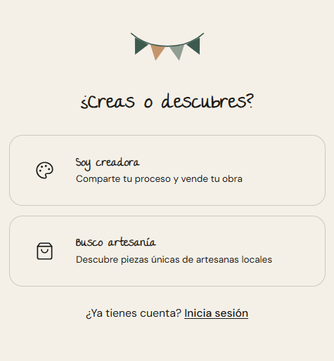

<p align="center">
  
</p>

<h1 align="center">Artelier</h1>

<p align="center">
  
  
  
  
  
  
</p>

<p align="center"><strong>Marketplace de artesanía y producción local de Galicia.</strong></p>

<p align="center">
Artelier conecta artesanos y pequeños productores gallegos con compradores interesados en consumo lento, responsable y de proximidad — disponible 24/7, sin coste para el artesano, sin depender de mercados físicos.
</p>

---

<p align="center">
  
</p>

---

## El problema que resuelve

Los artesanos locales dependen de ferias puntuales con coste elevado (stand, inscripción, transporte) que generan ganancia mínima. Su presencia digital está fragmentada entre Instagram, Wallapop y Etsy, sin plataforma unificada ni cobro con tarjeta. Los compradores interesados en artesanía local no tienen un canal centralizado de descubrimiento y compra.

**Artelier elimina esas fricciones sin cambiar la esencia de lo que hace especial a la artesanía.**

---

## Filosofía

> *Aquí las cosas buenas se esperan.*

Artelier opera bajo el principio del **slow commerce**: el tiempo de espera, la escasez natural del producto artesanal y la transparencia del proceso de fabricación son parte del valor, no obstáculos. El artesano es el protagonista — el comprador no compra cerámica, compra la cerámica de María de Lugo, que lleva 12 años en el oficio.

---

## Funcionalidades del MVP

### Para artesanos
- Perfil público gratuito con pestaña de tienda y pestaña de contenidos de proceso
- Catálogo con stock único (cada pieza es irrepetible — la compra agota el stock automáticamente) y productos perecederos con auto-retiro por fecha
- Recepción de pedidos personalizados directos y actualización de estados de fabricación
- Sellos verificados: Km 0 · Hecho en Galicia · Ecológico · Reciclado · Artesanal certificado
- Cobro mediante Stripe Connect — el artesano recibe el precio de venta limpio

### Para compradores
- Feed cronológico de artesanos seguidos
- Descubrimiento por localidad, categoría y sello de verificación
- Mensajería privada directa con artesanos para coordinar encargos personalizados
- Checkout con desglose completo (precio + comisiones) antes de pagar
- Opciones de entrega: envío de la plataforma, envío propio del artesano o recogida en persona

### Para todos
- Modelo de confianza: sistema de disputas con revisión por admin, política de devoluciones adaptada al producto artesanal y ventana de cancelación de 24h
- Cumplimiento RGPD / LSSI y directiva europea de derechos del consumidor

---

## Stack técnico

| Capa | Tecnología |
|------|------------|
| Frontend | Next.js 15 (App Router, SSR/SSG) |
| Lenguaje | TypeScript 5 |
| Estilos | Tailwind CSS |
| ORM | Prisma + PostgreSQL 17 |
| Auth | Auth.js v5 |
| Pagos | Stripe Connect Express |
| i18n | next-intl |
| Deploy | Vercel |
| Mobile (V2) | Flutter — iOS y Android sobre la misma API |

---

## Desarrollo local

```bash
# Instalar dependencias
npm install

# Configurar variables de entorno
cp .env.example .env

# Aplicar migraciones de base de datos
npx prisma migrate dev

# Arrancar servidor de desarrollo
npm run dev
```

Abre [http://localhost:3000](http://localhost:3000) en tu navegador.

---

## Modelo de negocio

- **Perfil del artesano:** siempre gratuito
- **Comisión por venta:** porcentaje sobre el total, pagado por el comprador
- **Comisión de seguro:** porcentaje sobre el total, pagado por el comprador
- **Fee de transacción:** coste de pasarela Stripe, pagado por el comprador
- **Primera venta:** sin comisión (incentivo de onboarding para el artesano)

---

## Hoja de ruta

### MVP — Web App *(en desarrollo activo)*
Perfiles · Catálogo · Pagos · Mensajería · Sellos verificados · Notificaciones por email · Descubrimiento · Disputas y devoluciones

### V2 — Mobile + Crecimiento
App Flutter (iOS + Android) · Mapa interactivo de Galicia · Mercados temáticos de plataforma (eventos de 48h) · Pre-pedidos · Herramientas de contenido asistido por IA · Envío coordinado multi-artesano · Algoritmo de recomendación · Engagement social

### V3 — Visión
Live streaming desde el taller · Cesta multi-artesano · Eventos promocionales · Interfaz multiidioma gallego/castellano

---

## Licencia

© 2026 Carla Portela Ubeira — Todos los derechos reservados. Consulta [LICENSE](./LICENSE).
