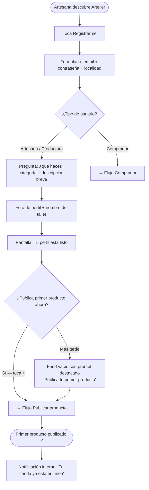
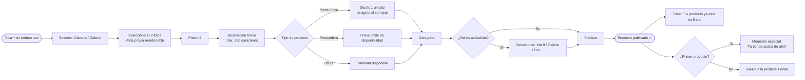
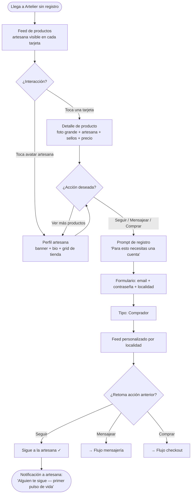
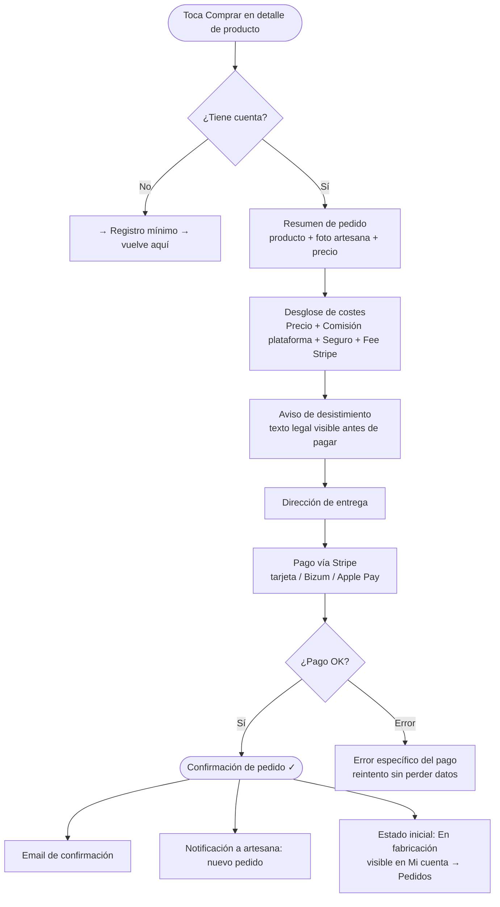
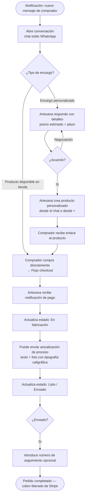
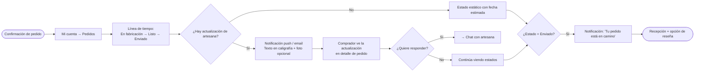

# UX Design Specification - Artelier

**Author:** Maldita
**Date:** 2026-05-11

---

<!-- UX design content will be appended sequentially through collaborative workflow steps -->

## Resumen Ejecutivo

### Visión del Proyecto

Artelier es un marketplace de artesanía y producción local gallega que opera bajo la filosofía del *slow commerce*: el tiempo de espera, la escasez natural del producto artesanal y la transparencia del proceso de creación son parte del valor, no obstáculos. A diferencia de cualquier marketplace convencional, el artesano es el protagonista — el comprador no compra un producto, construye una relación con la persona que lo hace.

La plataforma conecta dos mundos con necesidades radicalmente distintas: artesanos que necesitan un escaparate permanente y gratuito sin fricción técnica, y compradores que buscan autenticidad, proximidad y la historia detrás de lo que compran.

### Usuarios Objetivo

**Artesano / Productor local**
- Perfil representativo: mujer de 40s, taller en zona rural o semi-urbana de Galicia, usa Instagram para vender por DMs, no muy cómoda con tecnología compleja
- Dispositivo principal: móvil, en el taller entre trabajo
- Motivación: tener un escaparate siempre abierto sin coste fijo ni desplazamientos
- Barrera principal: cualquier fricción en el flujo de creación de perfil o producto la hace abandonar
- Momento emocional máximo: la primera interacción — alguien la sigue, alguien le escribe

**Comprador / Consumidor responsable**
- Perfil representativo: persona de 30-40s en ciudad gallega, interesado en consumo local y responsable, va a mercados cuando puede pero no siempre llega a tiempo
- Dispositivo principal: móvil y web indistintamente
- Motivación: conocer a las personas detrás de lo que compra, acceder a productos que no encuentra en tiendas
- Barrera principal: no saber qué hay disponible ni cómo contactar con productores locales

**Administrador de plataforma**
- Equipo Artelier, escritorio, gestión operativa: sellos de verificación, disputas, moderación de perfiles

### Retos Clave de Diseño

1. **Dos arquitecturas de información radicalmente distintas** — Artesano (creador: tienda + contenidos + pedidos) y comprador (explorador: feed + búsqueda + compra) necesitan estructuras de navegación propias, no una sola con condiciones.

2. **Onboarding de artesanos no digitales** — El flujo de creación de perfil y primer producto debe completarse en menos de 20 minutos desde el móvil, sin instrucciones. El primer obstáculo técnico mata la tracción inicial.

3. **La paradoja del slow commerce** — Toda la web entrena al usuario para "compra en 1 clic". Artelier hace lo contrario: el diseño debe crear deseo y anticipación, no urgencia. Eso es un cambio de registro emocional intencional.

4. **Checkout con desglose de costes visible** — El comprador ve precio + comisión plataforma + comisión seguro + fee Stripe. Mal diseñado, parece punición. Bien diseñado, es transparencia y confianza.

5. **Web responsive como primera plataforma para usuarios móviles** — El MVP es web, pero artesanos y compradores usarán el móvil. El diseño responsive debe sentirse nativo desde el día uno.

### Oportunidades de Diseño

1. **La metáfora del puesto de mercado** — El artesano siempre presente en su tienda: descripción breve, foto y nombre visibles en el catálogo, como cuando te acercas a un puesto y ves a la persona detrás. Esta metáfora espacial puede guiar toda la arquitectura del perfil artesano.

2. **La primera notificación como momento emocional máximo** — El "primer pulso de vida" del artesano (primer seguidor, primer mensaje) debe sentirse especial, no genérico. Es el motor de retención más poderoso de la plataforma.

3. **Los sellos verificados como identidad visual** — Km 0, Hecho en Galicia, Ecológico no son solo filtros — son distintivos de identidad que pueden convertirse en los elementos visuales más reconocibles de Artelier en tarjetas y perfiles.

4. **El proceso como narrativa visual** — Los estados de fabricación (En fabricación → Listo → Enviado) y la pestaña de contenidos pueden convertir la espera del pedido en una experiencia editorial: el comprador sigue el viaje de su pieza como un mini-documental.

---

## Experiencia de Usuario Core

### Experiencia Definitoria

Artelier es una plataforma de relaciones directas entre personas, no un catálogo con motor de compra. El valor central no está en el producto — está en la conexión entre quien hace y quien compra. Esa conexión se inicia con el descubrimiento visual inmediato, se profundiza con el contenido de proceso y se consolida con la comunicación directa para coordinar encargos personalizados.

El **bucle de vida de la plataforma:** artesana publica → comprador descubre sin fricción → comprador sigue o contacta → relación se establece → compra ocurre como consecuencia natural.

### Estrategia de Plataforma

**MVP:** Web app responsive, diseñada touch-first aunque sea web. Artesanas usarán el móvil desde el taller; compradores, desde el sofá. El diseño prioriza interacciones de una mano y pantallas pequeñas desde el primer día.

**V2:** App Flutter nativa (iOS + Android) sobre la misma API, cuando los usuarios reales de la web hayan validado el canal.

**Acceso público sin registro:** El feed de descubrimiento y los perfiles de artesano son accesibles e indexables sin cuenta. Cualquier persona puede llegar desde Google a la tienda de una artesana específica. El registro se solicita en el momento en que el usuario quiere interactuar (seguir, mensajear, comprar).

### Interacciones Sin Fricción

- **Artesana — publicar un producto:** foto → precio + descripción breve → publicar. Tres pasos desde el móvil, sin formularios complejos. Es la acción más crítica: sin producto publicado no hay descubrimiento, no hay mensajes, no hay ventas.
- **Artesana — responder a un mensaje o pedido** en el menor número de pasos posible desde cualquier contexto (notificación directa, historial de conversaciones, detalle de pedido). Segunda acción más crítica: es la que activa la relación y el encargo personalizado.
- **Comprador — ver el feed sin registro:** llegada directa al contenido sin barreras. Primera impresión es siempre producto real.
- **Comprador — establecer su localidad:** en el momento del registro, mediante pregunta explícita o geolocalización del dispositivo. Una sola vez, persistida y editable. La localización personaliza el feed desde ese momento.
- **Comprador — seguir a una artesana** con un solo toque desde cualquier punto donde aparezca su perfil.
- **Sistema — agotar stock al comprar** y **retirar productos perecederos al vencer fecha** de forma automática, sin ninguna acción de la artesana.

### Momentos Críticos de Éxito

| Momento | Usuario | Por qué es crítico |
|---------|---------|-------------------|
| Primer producto publicado en menos de 5 minutos | Artesana | Valida que el onboarding no tiene fricción técnica; es la puerta a todo lo demás |
| Primera notificación recibida (seguidor o mensaje) | Artesana | El "primer pulso de vida" — decide si la plataforma se siente viva o vacía |
| Primera respuesta enviada a un encargo | Artesana | Valida el flujo de comunicación; si hay un obstáculo aquí, se pierde la venta |
| Primera carga del feed sin registro | Comprador | Debe mostrar artesanas reales y atractivas — no una pantalla vacía ni un genérico |
| Feed personalizado tras registrarse con localidad | Comprador | El momento "esto es de aquí, de gente real cerca de mí" |
| Checkout completado con desglose visible | Comprador | Si el coste total se siente justo y explicado, genera confianza; si no, genera abandono |

### Principios de Experiencia

1. **El producto publicado es la llave** — La artesana debe poder publicar su primer producto en 3 pasos desde el móvil, sin instrucciones. Hasta que no hay producto, no existe nada más.

2. **La respuesta directa como diferencial** — El flujo de comunicación artesana ↔ comprador es la segunda pieza más crítica. Los encargos personalizados y las relaciones nacen ahí. Debe ser tan simple como un WhatsApp.

3. **Descubrimiento sin barreras, personalización en el momento justo** — El feed es público y visible desde el primer segundo. La localidad se captura cuando el usuario ya ha decidido quedarse — en el registro, no antes.

4. **La persona antes que el producto** — En cada punto de contacto con un producto, la artesana que lo hizo es inseparable: nombre, foto y descripción breve siempre presentes. El catálogo nunca se convierte en un grid anónimo.

5. **La espera es intencional** — Los estados vacíos, los de carga y los de pedido en fabricación comunican lentitud como valor, no como defecto. El diseño celebra el tiempo, no se disculpa por él.

6. **Transparencia total en cada transacción** — En el checkout: cada número explicado, sin sorpresas, las excepciones legales visibles antes de pagar. La confianza se construye en el diseño, no en las FAQs.

---

## Respuesta Emocional Deseada

### Objetivos Emocionales Primarios

**Artesana — Calma sostenida + Orgullo creativo en equilibrio**
En el uso diario: la plataforma trabaja mientras ella trabaja — su escaparate existe sin que ella tenga que estar pendiente. Eso es calma. En los momentos de interacción: tiene una audiencia que espera lo que crea, sus actualizaciones de proceso reciben atención, sus encargos llegan. Eso es orgullo creativo. El diseño honra ambos: no interfiere en su trabajo ni demanda atención constante, pero cuando ella abre la plataforma le recuerda que hay personas esperando lo que hace.

**Comprador — Conexión narrativa con el origen de lo que compra**
Cuando espera un encargo personalizado, no está esperando un paquete — está siguiendo el proceso de creación de algo hecho para él. Los estados de fabricación y las actualizaciones de proceso del artesano convierten la espera en seguimiento activo. La satisfacción no llega solo cuando el objeto llega, sino durante todo el proceso.

### Mapa del Viaje Emocional

**Artesana:**

| Momento | Emoción objetivo |
|---------|-----------------|
| Registro y creación de perfil | Esperanza y posibilidad |
| Primer producto publicado | Orgullo y logro |
| Primera notificación (seguidor / mensaje) | Validación — "alguien me ve" |
| Primer encargo personalizado recibido | Propósito — "soy protagonista, no anónima" |
| Primera venta completada | Alivio y confirmación — "funciona" |
| Uso diario sostenido | Calma + orgullo creativo en equilibrio |

**Comprador:**

| Momento | Emoción objetivo |
|---------|-----------------|
| Primera llegada al feed | Curiosidad y sorpresa — "no sabía que había esto aquí" |
| Exploración de perfiles | Calidez y conexión — "son personas reales" |
| Seguir a una artesana | Pertenencia — "quiero seguir este proceso" |
| Notificación de nuevo producto | Anticipación — "algo escaso y único" |
| Checkout | Confianza y claridad — "sé exactamente lo que pago" |
| Espera del encargo | Conexión narrativa — "estoy viendo nacer mi pieza" |
| Recepción del paquete | Satisfacción profunda — "esto tiene alma" |

### Micro-Emociones

**Para la artesana:**
- Pequeño orgullo cuando el admin aprueba su sello verificado
- Nerviosismo anticipado antes de la primera venta, alivio cuando llega el dinero a Stripe
- Satisfacción silenciosa al ver que el comprador ha visto su actualización de proceso

**Para el comprador:**
- El pequeño impulso de urgencia al ver "1 unidad disponible"
- La calidez de leer la descripción de proceso escrita por la artesana
- La satisfacción de saber exactamente de quién y de dónde viene lo que compró
- La emoción suave de seguir los estados de fabricación de su encargo, como capítulos de una historia

### Implicaciones de Diseño

| Emoción objetivo | Decisión de diseño |
|-----------------|-------------------|
| Validación artesana (primer pulso de vida) | Las notificaciones de primera interacción deben sentirse celebratorias, no genéricas — un momento de diseño especial, no un número incrementado |
| Calma artesana (uso diario) | La plataforma no interrumpe ni demanda atención; las notificaciones respetan el flujo de trabajo de alguien que trabaja con las manos |
| Orgullo creativo artesana | El contenido de proceso tiene visibilidad destacada en el perfil; la artesana ve que su audiencia lo consume |
| Conexión narrativa comprador | Los estados de fabricación y las actualizaciones de proceso son visibles y prominentes en el historial de pedidos del comprador |
| Confianza comprador (checkout) | Desglose completo y explicado de cada coste antes de confirmar; sin sorpresas en ningún paso |
| Anticipación comprador (escasez) | "1 unidad disponible" como elemento visual prominente, nunca escondido |
| Evitar confusión | Publicar un producto en máximo 3 pasos; cero jerga técnica |
| Evitar ansiedad | Políticas de devolución y excepciones visibles antes de confirmar, no en letra pequeña |
| Evitar impaciencia | La espera nunca se presenta como error — tiene nombre, tiene actualizaciones, tiene narrativa |

### Principios de Diseño Emocional

1. **Celebrar el primer pulso** — El primer seguidor, el primer mensaje y la primera venta merecen un momento de diseño especial. No un número incrementado — una notificación que se siente como reconocimiento.

2. **La espera tiene nombre y tiene historia** — Ningún estado de pedido dice "procesando". Cada estado (En fabricación → Listo → Enviado) es un capítulo en la historia del objeto que el comprador está esperando.

3. **Respetar el flujo de la artesana** — La plataforma es un asistente silencioso que trabaja cuando ella no está mirando. Las notificaciones no interrumpen, los formularios no distraen.

4. **La confianza se gana en el checkout** — El momento de más ansiedad potencial es el pago. El diseño del checkout es la inversión emocional más importante: claridad total, sin sorpresas, con contexto para cada número.

5. **El objeto tiene alma porque tiene origen** — La foto, el nombre y la historia de la artesana están presentes en cada producto, en cada notificación y en cada confirmación de pedido. El comprador nunca pierde el hilo de con quién está tratando.

---

## Análisis de Patrones UX e Inspiración

### Análisis de Productos Inspiradores

**Vinted — el estándar de experiencia que las usuarias ya conocen**

Las artesanas gallegas ya usan Vinted. Cualquier patrón tomado de Vinted reduce la curva de aprendizaje para el lado más crítico de la plataforma.

Lo que hace bien desde UX:
- **Flujo de publicación foto-primero:** abre la cámara o galería inmediatamente, los detalles vienen después. Diseñado para móvil, una mano, en el taller.
- **Mensajería limpia y familiar:** prácticamente idéntica a WhatsApp. Sin fricción de aprendizaje.
- **Protección de transacción visible en cada producto:** reduce ansiedad de compra antes del checkout.
- **Navegación bottom bar simple:** Inicio · Explorar · Vender · Mensajes · Perfil — predecible, sin sorpresas.

**Etsy — la referencia de perfil de tienda artesanal**

Lo que hace bien:
- **Estructura del perfil de tienda:** banner + avatar + nombre + bio corta + grid de productos. Inmediatamente personal y navegable.
- **Señales de confianza visibles:** badges, reseñas con puntuación. El equivalente en Artelier son los sellos verificados.
- **Botón "Message seller" en cada producto:** contacto directo accesible sin navegar fuera del producto.

**Instagram — el grid visual y el modelo de seguir al creador**

Lo que hace bien:
- **Grid de 3 columnas en el perfil:** muestra el rango y estilo del trabajo de un artesano de un vistazo.
- **El modelo "sigue al creador":** el usuario sigue a una persona, recibe notificación de su nuevo contenido. Artelier replica exactamente esto.
- **Perfil: avatar + nombre + bio breve:** todo lo esencial visible sin scroll, el grid de trabajo inmediatamente debajo.

### Patrones UX Transferibles

**Navegación:**
- **Bottom bar al estilo Vinted** — 5 acciones máximo, siempre visible, predecible. Para Artelier: Feed · Descubrir · [+Publicar] · Mensajes · Mi cuenta. El botón central de publicar destacado en color para la artesana.

**Publicación de producto:**
- **Flujo foto-primero de Vinted** — La cámara/galería se abre en el primer paso. Después: precio + descripción + categoría. Tres pasos, móvil, una mano. Artelier elimina los campos que no aplican (condición, talla) y añade solo los suyos (tipo: único / perecedero).

**Perfil de artesana:**
- **Estructura de tienda de Etsy** — banner + avatar + nombre + bio breve + grid de productos como base del perfil artesano, con la descripción breve siempre visible (metáfora del puesto de mercado).
- **Grid de 3 columnas de Instagram** — para la pestaña de tienda. Inmediato, visual, comunicativo del estilo de trabajo.

**Mensajería:**
- **Estilo WhatsApp / Vinted** — familiar para el 100% de usuarias objetivo. Sin aprendizaje.

**Confianza:**
- **Señales de confianza visibles en producto y perfil** — los sellos verificados (Km 0, Hecho en Galicia, Ecológico) reemplazan las estrellas como indicadores de autenticidad.

### Anti-Patrones a Evitar

| Anti-patrón | De dónde viene | Por qué no en Artelier |
|------------|----------------|----------------------|
| Artesana anónima en resultados de búsqueda | Etsy | En Artelier, nombre y foto son inseparables del producto |
| Onboarding de vendedora con muchos campos | Etsy | Las artesanas no técnicas abandonan ante formularios largos |
| Opacidad de comisiones | Etsy | La transparencia total en checkout es un diferencial central |
| Feed algorítmico que decide qué ver | Instagram | MVP cronológico; el slow commerce no se impone |
| Scroll infinito adictivo | Instagram | El diseño respeta el tiempo del usuario, no lo secuestra |
| Grid de productos sin identidad personal | Etsy (búsqueda) | El artesano siempre presente — nombre visible bajo cada producto |

### Estrategia de Inspiración de Diseño

**Adoptar directamente:**
- Flujo de publicación foto-primero de Vinted (minimal, móvil, una mano)
- Mensajería estilo WhatsApp/Vinted (familiar, sin fricción)
- Bottom navigation bar de 5 elementos (Vinted)
- Grid de 3 columnas en el perfil de artesana (Instagram)

**Adaptar:**
- Estructura del perfil tienda de Etsy → añadir descripción breve de la artesana siempre visible + pestaña de contenidos de proceso
- Señales de confianza de Etsy → reemplazar estrellas por sellos verificados con identidad local
- Grid de Instagram → mostrar nombre de la artesana bajo cada item para que el producto nunca sea anónimo

**Evitar activamente:**
- Cualquier complejidad de onboarding de Etsy
- Opacidad de comisiones de cualquier marketplace
- Feed algorítmico de Instagram
- Grid de búsqueda impersonal de Etsy

---

## Sistema de Diseño

### Elección del Sistema de Diseño

**Tailwind CSS + shadcn/ui**

### Justificación

- **Desarrolladora en solitario con experiencia en Tailwind** — cero curva de aprendizaje en la herramienta base. shadcn/ui se integra de forma natural como capa de componentes encima.
- **Next.js + Tailwind: integración nativa** — stack consolidado para SSR/SSG, con herramientas de desarrollo maduras y documentación extensiva.
- **Sin imposición visual** — Tailwind no tiene opiniones estéticas propias. La identidad cálida y editorial de Artelier es completamente controlable sin pelear contra un sistema ajeno.
- **WCAG AA de serie** — shadcn/ui está construido sobre Radix UI, el estándar de accesibilidad en React. El requisito NFR16 queda cubierto sin trabajo adicional.
- **Código propio, sin dependencias frágiles** — shadcn/ui genera componentes que viven en el proyecto. Sin actualizaciones de paquete que rompan el diseño; sin lock-in.

### Enfoque de Implementación

1. **Design tokens primero** — definir la paleta de colores, tipografía, espaciado y radios de borde como variables CSS y configuración de Tailwind antes de construir ninguna pantalla.
2. **Instalar shadcn/ui selectivamente** — solo los componentes necesarios para el MVP: Button, Input, Card, Dialog, Tabs, Badge, Avatar, Sheet, Separator, Toast.
3. **Componentes propios para las piezas únicas de Artelier** — tarjetas de producto con artesana siempre visible, sellos verificados como badges, perfil con grid de 3 columnas y barra de navegación inferior.

### Estrategia de Personalización

**Paleta de color** — identidad visual cálida y natural, coherente con el slow commerce y la artesanía gallega:
- Primario: tono tierra / terracota suave (cálido, artesanal)
- Superficie: crema / lino natural (fondo principal, no blanco puro)
- Acento: verde musgo o azul pizarra (acciones secundarias)
- Texto: marrón oscuro sobre crema (más cálido que negro sobre blanco)
- Sellos verificados: cada sello con su color propio para reconocimiento rápido

**Tipografía** — combinación editorial:
- Títulos y nombre de artesana: serif con personalidad (ej. Playfair Display, Lora)
- Cuerpo y UI: sans-serif limpia y legible (ej. Inter, DM Sans)
- Precios y datos: cifras tabulares para alineación en listas

**Componentes clave a medida:**
- `ProductCard` — foto + nombre del producto + precio + nombre de artesana + foto de artesana + sello(s)
- `ArtisanHeader` — banner + avatar + nombre + descripción breve + localidad + sellos + botón seguir
- `SealBadge` — variantes visuales para cada sello (Km 0, Hecho en Galicia, Ecológico, Reciclado, Artesanal)
- `BottomNav` — barra de navegación inferior persistente en móvil
- `OrderStatusTimeline` — estados de fabricación (En fabricación → Listo → Enviado) como línea de tiempo visual

---

## Experiencia Definitoria del Producto

### La Experiencia Que Define Artelier

**"Ver a la persona que hay detrás de lo que quieres comprar"**

En Tinder es el swipe. En Spotify es reproducir cualquier canción al instante. En Artelier es el momento en que el comprador deja de ver un producto y empieza a ver a una persona real que lo hace. Ese cambio de frame — de objeto a artesana — es el núcleo de toda la propuesta de valor y la interacción que, si se diseña bien, hace que todo lo demás se sostenga.

Para la artesana, el reflejo de ese mismo momento es la primera notificación: alguien la descubrió. Artelier existe para que ese momento ocurra, y ocurra bien.

### Modelo Mental del Usuario

**Comprador — lo que trae consigo:**
- Conoce Instagram: sigue personas, no marcas; espera ver trabajo + historia de quien lo hace
- Conoce Vinted: compra directamente a otra persona; espera mensajería simple y confianza en la transacción
- Conoce los mercados físicos: ha visto a la artesana detrás del stand, ha hablado con ella; esa experiencia es la referencia emocional
- Expectativa implícita: "esto es como un mercado pero digital — veo quién hace las cosas"

**Artesana — lo que trae consigo:**
- Vende por Instagram DMs: sabe publicar fotos, no sabe gestionar tienda online
- Usa Vinted o Wallapop: conoce el flujo de listar un artículo con foto y precio
- Expectativa: "si es tan fácil como subir una foto a Instagram, lo hago"

### Criterios de Éxito de la Experiencia Core

| Criterio | Indicador observable |
|----------|---------------------|
| El comprador ve a la persona, no solo el producto | Nombre y foto de la artesana visibles en la tarjeta de producto sin necesidad de entrar al perfil |
| La artesana publica su primer producto sin asistencia | Flujo completado en menos de 5 minutos desde el móvil, sin instrucciones |
| El primer contacto ocurre sin fricción | El botón de mensaje es accesible desde el producto y desde el perfil sin navegación adicional |
| La espera se siente como parte del valor | Nunca aparece un spinner sin contexto — siempre hay un estado con nombre y significado |

### Patrones: Establecidos vs. Novedosos

**Patrones establecidos (adoptar sin reinventar):**
- Grid de 3 columnas para el catálogo del artesano — los usuarios ya lo leen de Instagram
- Mensajería tipo chat — WhatsApp/Vinted es el estándar mental de todos los usuarios objetivo
- Bottom navigation bar — predecible, sin aprendizaje
- Foto-primero en la publicación de producto — Vinted lo ha establecido como el flujo natural

**Patrones novedosos (requieren diseño cuidadoso):**
- **Artesana siempre presente en el producto** — en Etsy o Vinted la persona desaparece en el grid de búsqueda; en Artelier nunca. Requiere diseño de tarjeta de producto específico.
- **Proceso de fabricación como capa de contenido** — la pestaña de contenidos y los estados de pedido como narrativa editorial no tienen equivalente en ningún marketplace conocido. Publicar una actualización de proceso debe ser tan simple como una historia de Instagram.
- **La espera con nombre y significado** — los estados En fabricación → Listo → Enviado como línea de tiempo visible en el historial del comprador. Convierte la espera pasiva en seguimiento activo.

### Mecánicas de la Experiencia Core

#### Publicar un producto (artesana) — la acción crítica

| Paso | Acción | Respuesta del sistema |
|------|--------|----------------------|
| 1. Inicio | Toca [+] en la barra de navegación inferior | Se abre selector: cámara / galería |
| 2. Foto | Selecciona hasta 3 fotos | Vista previa inmediata, reordenable |
| 3. Detalles | Precio → descripción breve → categoría → tipo (único / perecedero) | Campos mínimos, sin campos opcionales visibles por defecto |
| 4. Publicar | Toca "Publicar" | "Tu producto está publicado" + opción de compartir |
| Resultado | Vuelve a la pestaña de tienda con el nuevo producto visible | El producto es indexable por buscadores desde ese momento |

**Error handling:** si falta precio o foto, el sistema señala el campo específico — nunca un mensaje genérico de "formulario incompleto".

#### Descubrir a una artesana (comprador) — la experiencia definitoria

| Paso | Acción | Respuesta del sistema |
|------|--------|----------------------|
| 1. Llegada | Abre Artelier (sin registro) | Feed visual de productos — artesana visible en cada tarjeta |
| 2. Exploración | Scroll por el feed; toca una tarjeta que le llama la atención | Perfil de artesana: banner + descripción breve + grid de trabajo |
| 3. Conexión | Toca "Seguir", "Mensaje" o un producto del grid | Registro solicitado solo en este momento — con contexto claro de por qué |
| 4. Relación | Se registra y sigue a la artesana | Notificación inmediata a la artesana: el primer pulso de vida |

**El momento del registro** ocurre cuando el comprador ya ha visto valor y quiere interactuar — nunca antes. El formulario pide email + contraseña + localidad (o geolocalización). Tres campos. Sin fricción innecesaria.

---

## Visual Design Foundation

### Sistema de Color

**Paleta: Tinta y Lino**

Inspirada en los paisajes editoriales del slow living gallego: el verde pizarra de los bosques de eucalipto, el ámbar de la miel, el lino natural cálido. Es la paleta más editorial y contemporánea — evoca una revista de slow living, sostenibilidad consciente y diseño considerado. Se posiciona como plataforma premium con raíces.

| Token | Valor | Uso |
|---|---|---|
| `--primary` | `#3D5A4F` | Acciones principales, nav activo, botones CTA |
| `--accent` | `#C4956A` | Sellos Galicia, detalles cálidos, énfasis secundario |
| `--bg` | `#F4F0E8` | Fondo general de la app |
| `--surface` | `#EAE5DA` | Tarjetas, superficies elevadas |
| `--surface-2` | `#DDD7C8` | Avatares, fondos de entrada, placeholders |
| `--text` | `#1A1A18` | Texto principal |
| `--text-muted` | `#5A5648` | Texto secundario, labels |
| `--text-light` | `#8A8478` | Texto terciario, hints, metadatos |
| `--border` | `#CCC8BC` | Separadores, bordes de tarjeta |

**Tokens de sellos verificados:**

| Sello | Color texto | Color fondo |
|---|---|---|
| Km 0 | `#3D5A4F` | `#C8DDD8` |
| Hecho en Galicia | `#C4956A` | `#F5E8D8` |
| Ecológico | `#2E6B48` | `#C4E0D4` |

### Sistema Tipográfico

**Display / Titulares: The Girl Next Door** — caligrafía artesanal legible. Transmite la identidad handmade de la plataforma sin sacrificar claridad. Se usa en: logotipo, encabezados de sección, sellos de verificación, CTAs, nav links, nombre del artesano en actualizaciones de estado, texto citado del artesano entre comillas.

**Body / UI: DM Sans** — sans-serif humanista, cálida y legible a tamaños pequeños. Se usa en: todo el texto de interfaz, precios, etiquetas, descripciones, metadatos.

| Nivel | Fuente | Tamaño | Peso |
|---|---|---|---|
| Logotipo / Brand | The Girl Next Door | 22px | 700 |
| Encabezado sección | The Girl Next Door | 18–20px | 600 |
| Sello verificado | The Girl Next Door | 12–14px | 400 |
| Nav links | The Girl Next Door | 14px | 700 |
| Nombre artesano (actualización) | The Girl Next Door | 15px | 700 |
| Texto citado artesano | The Girl Next Door | 13px | 400 |
| Body principal | DM Sans | 13–14px | 400–500 |
| Metadatos / labels | DM Sans | 10–11px | 500–700 |

### Espaciado y Layout

- **Unidad base**: 4px; escala práctica en múltiplos de 4 y 8
- **Radios de borde**: 4px (sellos), 8px (notices y avisos), 12px (tarjetas, navs, perfiles), 100px (botones pill)
- **Layout**: columna única centrada, max-width 900px, padding lateral 20–24px
- **Tarjetas de producto**: grid de 2 columnas en móvil
- **Filosofía de espacio**: generoso dentro de las tarjetas y perfiles, denso en metadatos y listas — el espacio blanco refuerza el valor artesanal y el slow commerce

### Consideraciones de Accesibilidad

- Contraste `--primary` (#3D5A4F) sobre `--bg` (#F4F0E8): ≥ 4.5:1 ✓
- Contraste `--text` (#1A1A18) sobre `--bg` (#F4F0E8): ≥ 15:1 ✓
- Tamaño mínimo de fuente en UI: 10px (labels); 13px para contenido legible
- Touch targets mínimos: 44×44px en todos los elementos interactivos (nav items, botones)
- Iconos de navegación: stroke sólido sin filtros de distorsión, `stroke-width: 2.2`, tamaño 22×22px

---

## Design Direction Decision

### Dirección Elegida

La dirección de diseño quedó establecida durante la exploración visual del Paso 8. No se generaron variantes adicionales de layout porque las decisiones de composición emergieron de forma orgánica e iterativa durante el proceso de construcción del explorador visual.

### Patrones de Layout Confirmados

- **Feed**: grid de 2 columnas con tarjetas de producto — foto, precio, nombre del artesano y sellos siempre visibles sin entrar al detalle
- **Perfil artesano**: banner + avatar superpuesto + nombre + bio breve + sellos de verificación + grid 3 columnas para el catálogo
- **Navegación inferior (móvil)**: 5 elementos — Inicio · Buscar · [+Publicar destacado] · Mensajes · Mi cuenta
- **Navegación superior (web)**: logotipo + links Descubrir / Entrar / Registrarme en The Girl Next Door
- **Checkout**: desglose de costes completo y visible antes del CTA de pago, con aviso legal de desistimiento
- **Estado de pedido**: línea de tiempo horizontal (En fabricación → Listo → Enviado) + actualización de estado personalizada del artesano con texto citado en caligrafía

### Artefacto Visual de Referencia

El archivo `_bmad-output/planning-artifacts/ux-color-themes.html` documenta la dirección de diseño completa con todos los patrones de pantalla implementados e interactivos.

---

## User Journey Flows

### Flujo 1 — Onboarding de artesana (primer producto publicado)

El journey más crítico de toda la plataforma. Sin artesanas con productos, no hay comprador, no hay marketplace.

**Optimizaciones clave:** el tipo de cuenta se elige una vez, con iconos grandes y sin jerga técnica. El onboarding no pide más datos hasta que el primer producto está publicado — todo lo demás (bio larga, redes sociales) es editable después.

---

### Flujo 2 — Publicar un producto (artesana)

**Optimizaciones clave:** máximo 4 pasos obligatorios. Los sellos son opcionales y se pueden añadir/quitar después. El sistema retira automáticamente los perecederos en la fecha límite.

---

### Flujo 3 — Comprador: descubrimiento y primer contacto

**Optimizaciones clave:** el registro se solicita solo cuando el comprador quiere interactuar, con contexto explícito de por qué. Tras el registro, el sistema retoma la acción interrumpida.

---

### Flujo 4 — Comprador: checkout

**Optimizaciones clave:** desglose de costes visible completo antes del CTA de pago. El aviso de desistimiento es un notice visible, no letra pequeña. Si el pago falla, se preservan todos los datos introducidos.

---

### Flujo 5 — Artesana: gestionar un encargo personalizado

---

### Flujo 6 — Comprador: seguimiento del pedido

---

### Patrones de Journey

**Navegación:** registro siempre diferido al momento de interacción real; acción interrumpida se retoma automáticamente tras el registro.

**Feedback:** toast no bloqueante para acciones exitosas; notificación especial para hitos de primera vez (primer producto, primer seguidor, primera venta).

**Progresión:** los flujos de artesana son secuenciales (crear → gestionar → cobrar); los del comprador son exploratorios con múltiples puntos de entrada al mismo destino.

**Error handling:** siempre indica el campo o problema específico, nunca mensaje genérico; en pagos, preserva todos los datos introducidos en caso de error.
